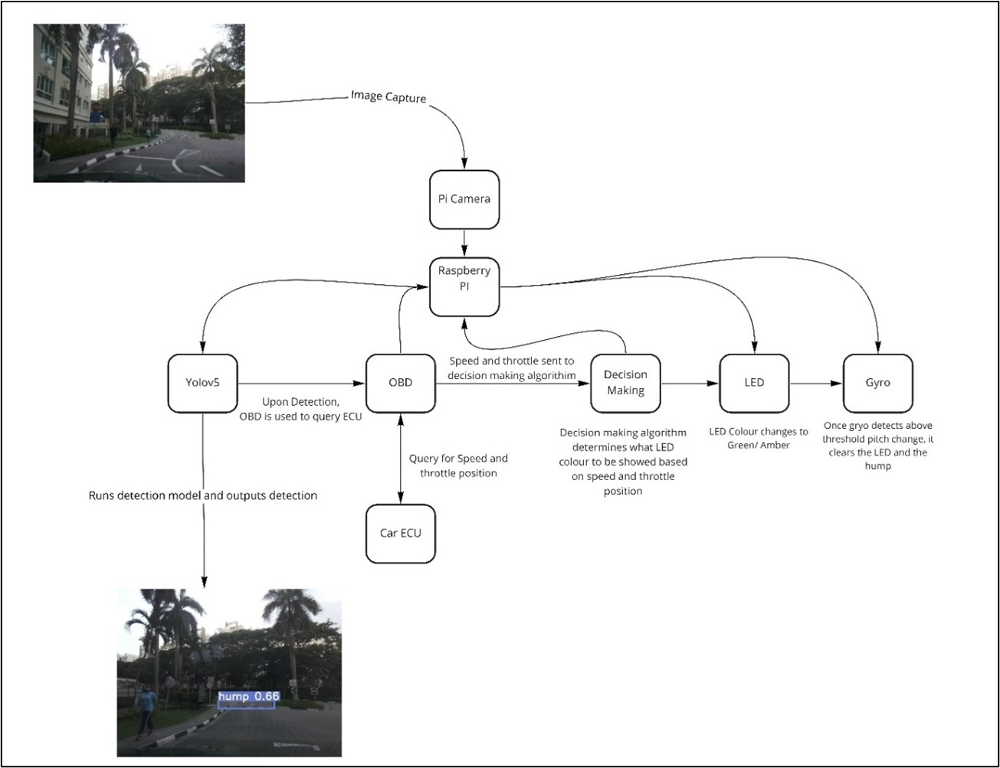

# Project - Safe Car Assistant System (SCAS)

## Project Motivation 
Our idea revolves around the idea of a **safe driving assistant.** We want to tackle some of the root causes of traffic accident. We want to make use of technology to help prevent potential road accidents from happening. Our aim is to provide drivers accident-free driving, and to provide a safe and responsible driving environment for all road users in Singapore. 

## System Design Overview

## Install Instructions
Install Pytorch
1. pip3 install torch-1.6.0a0+b31f58d-cp37-cp37m-linux_armv7l.whl  

Install Torch Vision

2. pip3 install torchvision-0.7.0a0+78ed10c-cp37-cp37m-linux_armv7l.whl

Enable bluetooth

3. sudo bluetoothctl
4. power on
5. scan on

Pair & Trust OBD2 Dongle

6. pair 00:00:00:33:33:33
7. trust 00:00:00:33:33:33
8. scan off
9. quit

Bind OBD2 Dongle to rfcomm

10. sudo rfcomm bind rfcomm0 00:00:00:33:33

Run the detector

11. cd Detector_Yolov5
12. pip3 install -r requirements.txt
13. python3 detect.py --source 0  --weights model5s.pt --conf 0.3 --img 224

# Group Members
|Github username|Name|Student ID|
|:-|:-|:-|
|bomerzz|Isaac Ibrahim|1901859|
|Arthurtay|Arthur Tay Meng Yao|1901824|
|wilburlua910|Wilbur Lua Kai Heng|1901839|
|A-Flying-Poro|Wong Kah Wai|1901835|
|kaiongit|Wang Kai|1901896|
